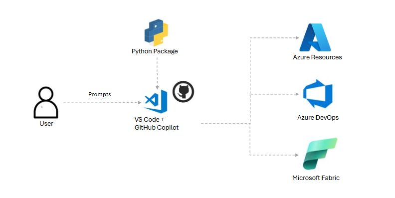

# Azure Platform Agent - Installation Guide

## Description

**Azure Platform Agent** is a Model Context Protocol (MCP) server that enables secure, compliant Azure resource deployment directly from VS Code using GitHub Copilot Chat. It provides a unified natural-language interface for managing Azure resources, Azure DevOps, and Microsoft Fabric — with built-in compliance orchestration, security best practices, and infrastructure-as-code (Bicep) templates.

---

## Architecture



---

## Tools Available

### General

| # | Tool | Description |
|---|------|-------------|
| 1 | **Show Agent Instructions** | Display complete agent documentation and usage guide. |

### Azure — Authentication & Account

| # | Tool | Description |
|---|------|-------------|
| 2 | **Azure Login** | Login to Azure with browser authentication. Handles single/multiple subscriptions automatically. |
| 3 | **List Subscriptions** | List all accessible Azure subscriptions with name, ID, state, and default flag. |
| 4 | **Set Subscription** | Set the active subscription context by ID or name. |
| 5 | **Get Current User** | Get current subscription, tenant, and user email. |

### Azure — Resource Management

| # | Tool | Description |
|---|------|-------------|
| 6 | **Create Resource Group** | Create Azure resource groups with project tagging. |
| 7 | **Create Resource** | Deploy Azure resources via Bicep templates with automatic compliance. Supported resources: |
| | | — Storage Account (ADLS Gen2) |
| | | — Key Vault |
| | | — Azure OpenAI |
| | | — AI Search |
| | | — AI Content Safety |
| | | — AI Document Intelligence |
| | | — AI Language Service |
| | | — AI Foundry (AI Hub) |
| | | — Cosmos DB |
| | | — Log Analytics Workspace |
| | | — User Assigned Managed Identity (UAMI) |
| | | — Network Security Perimeter (NSP) |
| | | — Fabric Capacity |
| | | — Container Registry (ACR) |
| | | — Function App (Flex Consumption) |
| | | — Function App (App Service Plan) |
| | | — App Service (Web App) |
| | | — Public IP |
| | | — Azure Data Factory |
| | | — Azure Synapse Analytics |
| | | — Network Security Group (NSG) |
| | | — Virtual Network (VNet) |
| | | — Subnet |
| | | — Private Endpoint |
| | | — Private DNS Zone |
| | | — DNS Zone VNet Link |
| | | — Logic App (Consumption) |
| | | — Redis Cache |
| | | — SQL Server |
| | | — SQL Database |
| | | — Application Insights |
| | | — Container Apps Environment |
| | | — Container App |
| | | — Data Collection Endpoint (DCE) |
| | | — Data Collection Rule (DCR) |
| | | — API Management (APIM) |
| 8 | **Get Bicep Requirements** | View required/optional parameters for any Bicep resource template before deployment. |
| 9 | **Get Resource Info** | Unified query tool — list resource groups, list/find resources, get resource details, get managed identity info, run custom KQL (Resource Graph) queries, or run raw CLI commands. |
| 10 | **Check Resource** | Check if a specific resource type exists in a resource group. |
| 11 | **Get Activity Log** | Retrieve activity logs for auditing and troubleshooting (up to 90 days). |
| 12 | **Update Tags** | Add, update, or replace tags on any Azure resource. |

### Azure — Security & Identity

| # | Tool | Description |
|---|------|-------------|
| 13 | **List Roles** | List active RBAC assignments or eligible PIM roles for the current user. |
| 14 | **Activate PIM Roles** | Activate eligible PIM roles — single role at a specific scope or all eligible roles at once. |
| 15 | **Assign PIM Eligible Role** | Create an eligible (not active) PIM role assignment for a user, group, or service principal. |
| 16 | **Assign RBAC Roles** | Assign RBAC roles to Service Principals or Managed Identities (supports bulk assignments). |

### Azure — Networking & Compliance

| # | Tool | Description |
|---|------|-------------|
| 17 | **Attach to NSP** | Attach a resource to a Network Security Perimeter (auto-creates NSP if needed). |
| 18 | **Attach Diagnostic Settings** | Configure Log Analytics diagnostic settings on a resource (auto-creates workspace if needed). |
| 19 | **Attach Application Insights** | Attach Application Insights to a Function App or App Service with connection string and instrumentation key. |
| 20 | **Create Private Endpoint** | Create a Private Endpoint with automatic DNS zone configuration and VNet link management. |
| 21 | **Manage PE Connections** | List, approve, or reject private endpoint connections on any Azure resource. |
| 22 | **Integrate VNet** | Regional VNet integration for App Service/Function App, or network ACL rules for Key Vault, Storage, Cosmos DB, OpenAI, SQL, and more. |

### Azure — Container Apps

| # | Tool | Description |
|---|------|-------------|
| 23 | **Create Container Apps Environment** | Create a Container Apps Environment with optional VNet integration and workload profiles. |
| 24 | **Create Container App** | Create a Container App with auto-detection/creation of environment, configurable scaling, CPU, and memory. |

### Azure — Monitoring (DCE/DCR)

| # | Tool | Description |
|---|------|-------------|
| 25 | **Create Data Collection Endpoint** | Create a DCE for Azure Monitor (required for Logs Ingestion API and AMPLS). |
| 26 | **Create Data Collection Rule** | Create a DCR with optional custom Log Analytics table and column definitions. |
| 27 | **Attach DCE to DCR** | Attach or update a Data Collection Endpoint on an existing Data Collection Rule. |

### Azure DevOps

| # | Tool | Description |
|---|------|-------------|
| 28 | **List Projects** | List all projects in an Azure DevOps organization. |
| 29 | **List Repos** | List all repositories in a project. |
| 30 | **Create Project** | Create a new Azure DevOps project with an initial repository. |
| 31 | **Create Repo** | Add a new Git repository to an existing project. |
| 32 | **Create Branch** | Create a branch from a base branch in a repository. |
| 33 | **Deploy Pipeline YAML** | Deploy pipeline YAML templates (CodeQL, 1ES) or custom YAML to a repository. |
| 34 | **Deploy Custom YAML** | Deploy custom YAML content directly to a repository file. |
| 35 | **Create Pipeline** | Create an Azure Pipeline from a YAML file already in the repository. |
| 36 | **Assign ADO Role** | Assign a security group role (Project Admin, Contributor, Reader, etc.) to a principal. |

### Microsoft Fabric

| # | Tool | Description |
|---|------|-------------|
| 37 | **List Fabric Permissions** | View workspace permissions and access levels for the current user. |
| 38 | **Create Workspace** | Create a Fabric workspace in a specified capacity. |
| 39 | **Assign Fabric Role** | Assign workspace roles (Admin, Contributor, Member, Viewer) to users, groups, or service principals. |
| 40 | **Attach Workspace to Git** | Connect a Fabric workspace to an Azure DevOps Git repository for version control. |
| 41 | **Create Deployment Pipeline** | Create Fabric deployment pipelines (Dev→Prod or Dev→UAT→Prod) and assign workspaces. |
| 42 | **Add Deployment Pipeline Role** | Add a role assignment to a Fabric deployment pipeline (auto-resolves user email to Object ID). |
| 43 | **Create Managed Private Endpoint** | Create a managed private endpoint from Fabric to Azure resources for secure connectivity. |
| 44 | **List Managed Private Endpoints** | List all managed private endpoints in a Fabric workspace with approval status. |

---

## Prerequisites

Before installing the AzForge Agent, ensure you have the following installed:

### Required Software

1. **Visual Studio Code** - [Download](https://code.visualstudio.com/download)
2. **PowerShell Core (pwsh)** - [Download](https://learn.microsoft.com/en-us/powershell/scripting/install/install-powershell-on-windows?view=powershell-7.5)
3. **Azure CLI** - [Download](https://learn.microsoft.com/en-us/cli/azure/install-azure-cli-windows?view=azure-cli-latest&pivots=winget)
4. **Python 3.10+** - [Download](https://www.python.org/downloads/)
5. **uvx** - [Download](https://docs.astral.sh/uv/getting-started/installation/)
6. **GitHub Copilot Chat Extension** - [Install from VS Code Marketplace](https://marketplace.visualstudio.com/items?itemName=GitHub.copilot-chat)

### Azure Requirements

- Active Azure subscription
- Appropriate Azure RBAC permissions for resource creation
- Azure CLI authenticated (`az login`)
- Set context for one subscription (`az account set --subscription <subscriptionid>`)

### ADO Requirements

- Access to Azure DevOps organization
- Project Collection Admin permissions for creating projects
- Project Admin permissions for creating repositories and pipelines
- Azure CLI authenticated (`az login` or `az login --allow-no-subscriptions`)

### Fabric Requirements

- Access to Microsoft Fabric workspaces
- Appropriate permissions to create and manage workspaces
- Fabric capacity available for workspace creation
- ADO available for Git integration
- Azure CLI authenticated (`az login` or `az login --allow-no-subscriptions`)

---

## Installation Steps

### Step 1: Open GitHub Copilot Chat

1. Launch **Visual Studio Code**
2. Open **GitHub Copilot Chat** (click the chat icon in the sidebar or press `Ctrl+Alt+I`)

### Step 2: Access MCP Tools Menu

1. In the Copilot Chat window, click on the **🔧 Tools** button
2. Select **"Install MCP Server from PyPI"** or similar option

### Step 3: Install the Package

1. When prompted for the package name, enter:
   ```
   azforgeagent
   ```
2. Select the **latest version** when prompted
3. Wait for the installation to complete

### Step 4: Configure MCP Settings
Add the following configuration to the `mcp.json` file:

```json
{
    "servers": {
        "azforgeagent": {
            "type": "stdio",
            "command": "uvx",
            "args": [
                "azforgeagent==1.0.0"
            ]
        }
    }
}
```

> **Note**: Replace `1.0.0` with the latest version number you installed.

### Step 5: Restart VS Code

1. Close and reopen Visual Studio Code to load the MCP server configuration
2. Open GitHub Copilot Chat again
3. Select the MCP Tool installed

### Step 6: Verify Installation

In GitHub Copilot Chat, type:
```
show menu
```

You should see the available actions menu confirming successful installation.

---

### Azure CLI Authentication

Ensure you're logged into Azure CLI:
```bash
az login
az account show
```

### PowerShell Core Required

This agent requires PowerShell Core (pwsh), not Windows PowerShell. Verify:
```bash
pwsh --version
```

---

## Usage Examples

### Azure

#### Authentication
```
login to azure
```
```
list my subscriptions
```
```
set subscription to <subscription-id>
```

#### Resource Management
```
create resource group named my-rg in eastus for project MyProject
```
```
create storage account in my-rg
```
```
create key vault in my-rg
```
```
create function app in my-rg
```
```
create container app in my-rg
```
```
create application insights in my-rg
```
```
list resources in my-rg
```
```
get info for resource my-storage in my-rg
```
```
get activity log for my-rg last 7 days
```
```
update tags on my-storage: environment=dev,team=platform
```

#### Security & Identity
```
list my active roles
```
```
list my eligible PIM roles
```
```
activate all my PIM roles with justification "sprint deployment"
```
```
assign Storage Blob Data Contributor role to managed identity <object-id> on resource group my-rg
```

#### Networking & Compliance
```
attach my-storage to network security perimeter in my-rg
```
```
attach diagnostic settings to my-storage in my-rg
```
```
attach application insights my-appinsights to webapp my-webapp
```
```
create private endpoint for my-storage blob in my-subnet
```
```
integrate my-function-app with vnet my-vnet subnet my-subnet
```

#### Monitoring (DCE/DCR)
```
create data collection endpoint my-dce in my-rg
```
```
create data collection rule my-dcr with custom table MyLogs in my-rg
```
```
attach dce my-dce to dcr my-dcr
```

### Azure DevOps

```
list all devops projects in organization myorg
```
```
list all repos in project MyProject
```
```
create azure devops project named MyProject with repo MainRepo in organization myorg
```
```
create devops repository named MyRepo in project MyProject
```
```
create branch feature/new-feature from main in MyRepo
```
```
deploy codeql pipeline yaml to MyRepo in pipelines folder
```
```
deploy custom yaml content to MyRepo
```
```
create pipeline named MyPipeline-1ES for MyRepo
```
```
create pipeline named "Source Branch Validation" for MyRepo with yaml path pipelines/sourcebranchvalidation.yml
```
```
assign Project Administrators role to <principal-id> in project MyProject
```

### Microsoft Fabric

```
list my fabric permissions
```
```
create fabric workspace named MyWorkspace in capacity /subscriptions/.../capacities/mycapacity
```
```
assign Admin role to <principal-id> in fabric workspace MyWorkspace
```
```
attach fabric workspace to azure devops git repo MyRepo in project MyProject
```
```
create deployment pipeline Dev-to-Prod with workspaces DevWS,ProdWS
```
```
add admin role to user@example.com on deployment pipeline <pipeline-id>
```
```
create managed private endpoint for storage blob in fabric workspace <workspace-id>
```
```
list managed private endpoints in fabric workspace <workspace-id>
```
